# 🎯 Bug Bounty Recon Pipeline

<p align="center">
  
  
  
  
</p>

> Pipeline automatizado de reconocimiento para programas de Bug Bounty. Ejecuta en cadena las herramientas más usadas por la comunidad para descubrir subdominios, validar hosts activos, detectar tecnologías, capturar screenshots y buscar vulnerabilidades conocidas — todo con un solo comando.

<br>

## 📑 Tabla de Contenidos

1. [Descripción del proyecto](#-descripción-del-proyecto)
2. [Características principales](#-características-principales)
3. [Requisitos y herramientas necesarias](#-requisitos-y-herramientas-necesarias)
4. [Verificación previa de dependencias](#-verificación-previa-de-dependencias)
5. [Instalación](#instalación)
6. [Estructura del proyecto](#-estructura-del-proyecto)
7. [Descripción de directorios](#-descripción-de-directorios)
8. [Uso del proyecto](#-uso-del-proyecto)
9. [Ejemplo de salida](#-ejemplo-de-salida)
10. [Buenas prácticas y notas adicionales](#-buenas-prácticas-y-notas-adicionales)
11. [Licencia](#-licencia)

<br>

## 📌 Descripción del proyecto

**Bug Bounty Recon Pipeline** es una herramienta de reconocimiento automatizado diseñada para investigadores de seguridad que participan en programas de **Bug Bounty** (como HackerOne, Bugcrowd, Intigriti o programas privados).

El pipeline orquesta en secuencia cinco herramientas ampliamente utilizadas en la comunidad ofensiva:
1. **Subfinder** → Enumeración de subdominios
2. **DNSx** → Resolución DNS y validación de hosts
3. **HTTPx** → Detección de hosts HTTP/S activos y fingerprinting de tecnologías
4. **GoWitness** → Captura de screenshots de interfaces web
5. **Nuclei** → Análisis automatizado de vulnerabilidades con templates

Al finalizar, genera automáticamente un **reporte HTML visual** y un **reporte JSON estructurado**, y puede enviar una notificación a **Telegram** con el resumen de resultados. Además, almacena un histórico de subdominios en una base de datos SQLite para detectar **nuevos subdominios** en ejecuciones posteriores.

**¿Para quién es esta herramienta?**
- Investigadores de seguridad en programas de Bug Bounty
- Pentesters durante la fase de reconocimiento externo
- Equipos de red team en ejercicios de simulación de amenazas
- Profesionales que quieran automatizar su workflow de recon

> ⚠️ **Uso ético y legal**: Esta herramienta debe utilizarse únicamente sobre dominios para los que tengas autorización explícita. El uso no autorizado puede ser ilegal.

<br>

## ✨ Características principales

- 🔍 **Enumeración masiva de subdominios** usando Subfinder con múltiples fuentes pasivas
- 🌐 **Resolución DNS activa** con DNSx, filtrando subdominios no resueltos y wildcards
- ⚡ **Probing HTTP/S concurrente** con HTTPx: detecta status codes, títulos y tecnologías
- 📸 **Capturas de pantalla automáticas** de todas las interfaces web encontradas con GoWitness
- 🔎 **Análisis de vulnerabilidades** con Nuclei sobre templates de severidad crítica, alta y media
- 📊 **Reporte HTML interactivo** con estadísticas, tabla de hosts activos y vulnerabilidades clasificadas por severidad
- 📋 **Reporte JSON estructurado** para integración con otras herramientas o plataformas
- 🗄️ **Base de datos histórica** en SQLite para comparar ejecuciones y detectar nuevos activos
- 📲 **Notificaciones por Telegram** con resumen de resultados al finalizar el pipeline
- 🔄 **Auto-descarga de templates de Nuclei** si no están presentes en el sistema
- 🛡️ **Gestión de timeouts** por herramienta para evitar bloqueos indefinidos
- 📁 **Organización por sesión**: cada ejecución genera su propio directorio con timestamp

<br>


## 🛠️ Requisitos y herramientas necesarias

### Sistema operativo

- Linux (Ubuntu/Debian recomendado) o macOS
- Windows con WSL2 (no oficial)

### Python

| Requisito | Versión mínima |
|-----------|---------------|
| Python    | 3.8+          |
| pip       | 21+           |

### Dependencias Python

```
requests>=2.28.0
```
<br>

---


### Herramientas externas (binarios)

Todas las herramientas siguientes deben estar instaladas y disponibles en el `$PATH` del sistema, a excepción de HTTPx que el script busca en `~/go/bin/httpx`.

| Herramienta | Propósito | Lenguaje | Repositorio oficial |
|-------------|-----------|----------|---------------------|
| `subfinder` | Enumeración pasiva de subdominios | Go | [projectdiscovery/subfinder](https://github.com/projectdiscovery/subfinder) |
| `dnsx`      | Resolución DNS activa y validación | Go | [projectdiscovery/dnsx](https://github.com/projectdiscovery/dnsx) |
| `httpx`     | Probing HTTP/S y fingerprinting    | Go | [projectdiscovery/httpx](https://github.com/projectdiscovery/httpx) |
| `gowitness` | Capturas de pantalla web           | Go | [sensepost/gowitness](https://github.com/sensepost/gowitness) |
| `nuclei`    | Escaneo de vulnerabilidades        | Go | [projectdiscovery/nuclei](https://github.com/projectdiscovery/nuclei) |

### Opcional

| Herramienta | Propósito |
|-------------|-----------|
| Bot de Telegram | Notificaciones en tiempo real al finalizar |

<br>


## 🛠️ Herramientas Integradas

### 1. **Subfinder**
- **Propósito**: Descubrimiento pasivo de subdominios
- **Fuentes**: Consulta múltiples fuentes públicas (CT logs, APIs, etc.)
- **Output**: `subdomains.txt` - Lista de subdominios descubiertos
- **Uso en el Pipeline**: Etapa inicial - genera el lista base para procesar
- **Ventaja**: Silencioso, no genera tráfico detectável

### 2. **DNSx**
- **Propósito**: Resolución DNS masiva y filtrado de wildcards
- **Función**: Confirma qué subdominios realmente resuelven a IPs
- **Output**: `resolved.txt` - Subdominios con IPs asociadas
- **Uso en el Pipeline**: Etapa 2 - filtra subdominios fantasma/wildcards
- **Ventaja**: Rápido, elimina hosts inactivos antes de probing HTTP

### 3. **HTTPx**
- **Propósito**: Probing HTTP/HTTPS masivo
- **Función**: Detecta qué hosts están vivos y accesibles por HTTP
- **Output**: `alive.json` - JSON con URLs activas, códigos de status, títulos, tecnologías
- **Uso en el Pipeline**: Etapa 3 - identifica servicios web activos
- **Ventaja**: Detecta tecnologías, sigue redirecciones, obtiene títulos

### 4. **GoWitness**
- **Propósito**: Captura de pantallas automática
- **Función**: Toma screenshots de todos los hosts descubiertos
- **Output**: Base de datos SQLite + archivos PNG
- **Uso en el Pipeline**: Etapa 4 - visualización rápida de servicios
- **Ventaja**: Identifica visualmente servicios, portales, errores, etc.

### 5. **Nuclei**
- **Propósito**: Scanner de vulnerabilidades con plantillas predefinidas
- **Función**: Ejecuta plantillas de seguridad contra hosts identificados
- **Output**: `vulnerabilities.json` - Hallazgos con severidad, descripción, evidencia
- **Uso en el Pipeline**: Etapa 5 - detección automática de vulnerabilidades
- **Ventaja**: Patrones conocidos, actualización continua de templates

<br>

## ✅ Verificación previa de dependencias

Antes de ejecutar el pipeline, comprueba que todas las herramientas están instaladas y accesibles:

```bash
# Verificar cada herramienta individualmente
subfinder -version
dnsx -version
httpx -version
gowitness version
nuclei -version

# Verificación rápida de todas a la vez
for tool in subfinder dnsx httpx gowitness nuclei; do
  if command -v "$tool" &> /dev/null; then
    echo "✅ $tool encontrado: $(command -v $tool)"
  else
    echo "❌ $tool NO encontrado"
  fi
done
```

Verificar que HTTPx está en la ruta específica que usa el script:

```bash
ls -la ~/go/bin/httpx
```

Verificar Python y pip:

```bash
python3 --version
pip3 --version
```

Verificar los templates de Nuclei (se descargan automáticamente si no existen):

```bash
ls ~/nuclei-templates/ | head -10
```

<br>

##  Instalación

### 1. Clonar el repositorio

```bash
git clone https://github.com/anaa-chun/bugbounty-recon-pipeline.git
cd bugbounty-recon-pipeline
```

### 2. Instalar dependencias Python

```bash
pip3 install -r requirements.txt
```

### 3. Instalar Go (necesario para las herramientas del pipeline)

```bash
# Ubuntu/Debian
sudo apt-get update && sudo apt-get install -y golang-go

# O descarga la versión más reciente desde:
# https://go.dev/dl/
```

Asegúrate de que el directorio `~/go/bin` está en tu `$PATH`:

```bash
echo 'export PATH=$PATH:$HOME/go/bin' >> ~/.bashrc
source ~/.bashrc
```

### 4. Instalar las herramientas de ProjectDiscovery

```bash
# Subfinder
go install -v github.com/projectdiscovery/subfinder/v2/cmd/subfinder@latest

# DNSx
go install -v github.com/projectdiscovery/dnsx/cmd/dnsx@latest

# HTTPx
go install -v github.com/projectdiscovery/httpx/cmd/httpx@latest

# Nuclei
go install -v github.com/projectdiscovery/nuclei/v3/cmd/nuclei@latest
```

### 5. Instalar GoWitness

```bash
go install github.com/sensepost/gowitness@latest
```

### 6. Descargar templates de Nuclei

Los templates se descargan automáticamente en la primera ejecución. Si prefieres hacerlo manualmente:

```bash
nuclei -update-templates
```

### 7. Configurar el archivo de configuración

```bash
# Copiar el archivo de ejemplo
cp config/config.example.json config/config.json

# Editar con tu editor preferido
nano config/config.json
```

Configura al menos las siguientes claves en `config/config.json`:

```json
{
  "telegram": {
    "bot_token": "TU_TOKEN_DEL_BOT",
    "chat_id": "TU_CHAT_ID",
    "enabled": true
  }
}
```

> Si no usas Telegram, deja `"enabled": false` y el pipeline funcionará igualmente.

### 8. (Opcional) Configurar fuentes de API para Subfinder

Para maximizar el número de subdominios encontrados, puedes configurar claves de API de servicios como Shodan, Censys, SecurityTrails, etc.:

```bash
# Crear el archivo de configuración de Subfinder
mkdir -p ~/.config/subfinder/
nano ~/.config/subfinder/provider-config.yaml
```

Consulta la [documentación oficial de Subfinder](https://github.com/projectdiscovery/subfinder#post-installation-instructions) para el formato del archivo.

<br>

## 📂 Estructura del proyecto
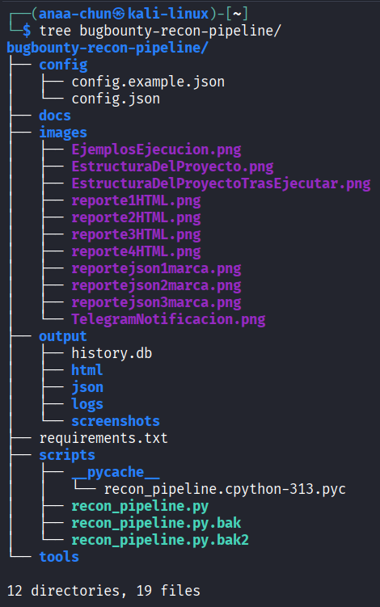 <br>


<br>

## 📁 Descripción de directorios

| Directorio / Archivo | Descripción |
|----------------------|-------------|
| `config/` | Contiene la configuración del pipeline. `config.json` es el archivo activo (excluido de git por seguridad). `config.example.json` es la plantilla que para copiar y rellenar. |
| `docs/` | Espacio reservado para documentación técnica adicional, diagramas de flujo o guías de uso avanzado. |
| `images/` | Recursos gráficos del proyecto (logos, capturas de ejemplo para la documentación). |
| `output/` | Directorio raíz de todos los resultados. Generado automáticamente. Excluido de git para no publicar datos sensibles de targets. |
| `output/html/` | Reportes HTML generados tras cada ejecución. Cada reporte tiene nombre con dominio y timestamp (`report_ejemplo.com_20250426_143000.html`). |
| `output/json/` | Reportes JSON estructurados con los mismos datos del HTML, listos para procesar con otras herramientas o scripts. |
| `output/logs/` | Archivos de log detallados de cada ejecución del pipeline con timestamps de cada paso. |
| `output/screenshots/` | Subdirectorios por sesión con las capturas de pantalla tomadas por GoWitness en formato JPEG/PNG. |
| `output/history.db` | Base de datos SQLite que almacena el historial de subdominios descubiertos por dominio, con fechas de primer y último avistamiento. |
| `scripts/` | Contiene el script principal `recon_pipeline.py` con toda la lógica del pipeline. |
| `tools/` | Reservado para utilidades auxiliares o scripts complementarios. |

<br>

## 🖥️ Uso del proyecto

### Ejecución básica

```bash
python3 scripts/recon_pipeline.py <dominio>
```

### Ejemplos

```bash
# Escanear un dominio objetivo
python3 scripts/recon_pipeline.py ejemplo.com

# Escanear desde cualquier directorio (usando ruta absoluta)
python3 /opt/bugbounty-recon-pipeline/scripts/recon_pipeline.py target.com
```

### Ejecución en segundo plano (recomendado para dominios grandes)

```bash
# Con nohup para que continúe aunque cierres la terminal
nohup python3 scripts/recon_pipeline.py ejemplo.com > output/logs/nohup.log 2>&1 &

# Ver el progreso en tiempo real
tail -f output/logs/nohup.log
```

### Automatización con cron (monitoreo periódico)

```bash
# Editar el crontab
crontab -e

# Ejemplo: ejecutar todos los días a las 3:00 AM
0 3 * * * cd /opt/bugbounty-recon-pipeline && python3 scripts/recon_pipeline.py ejemplo.com
```

### Flujo del Pipeline
```
┌──────────────┐      ┌──────────┐      ┌────────┐      ┌─────────────┐      ┌──────────┐
│  Subfinder   │ ───▶ │   DNSx   │ ───▶│ HTTPx  │ ───▶ │ GoWitness  │ ───▶ │ Nuclei   |
│ (Subdomains) │      │(Resolved)│      │(Alive) │      │(Screenshots)|      │ (Vuln)   │
└──────────────┘      └──────────┘      └────────┘      └─────────────┘      └──────────┘
                                              │
                                              ▼
                                    ┌─────────────────────┐
                                    │  SQLite Historial   │
                                    │ (Detección cambios) │
                                    └─────────────────────┘
                                              │
                                              ▼
                                    ┌─────────────────────┐
                                    │ Reporte HTML + JSON │
                                    │ Telegram Alerts     │
                                    └─────────────────────┘
```

**Flujo de Ejecución:**
1. **Subfinder** descubre subdominios usando múltiples fuentes públicas
2. **DNSx** resuelve los subdominios descubiertos a IPs válidas
3. **HTTPx** prueba qué hosts están activos y responden HTTP/HTTPS
4. **GoWitness** captura screenshots de todos los hosts activos
5. **Nuclei** ejecuta plantillas de vulnerabilidades contra los hosts
6. El pipeline genera reporte HTML y notifica cambios vía Telegram

<br>

## 📤 Ejemplo de salida

### Log de consola durante la ejecución
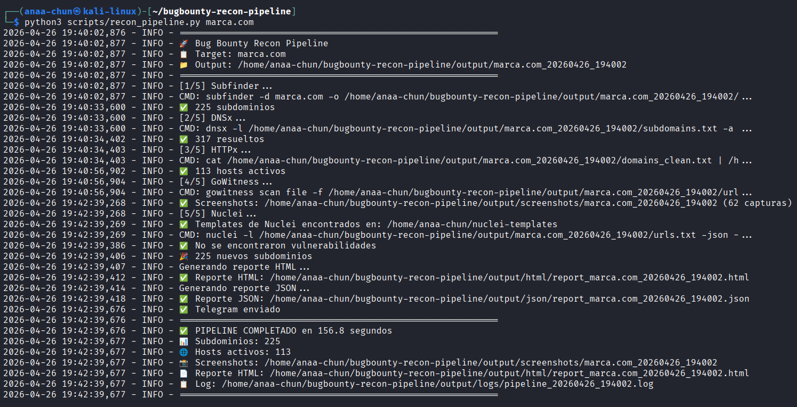 <br><br>

### Estructura del proyecto después de la ejecución
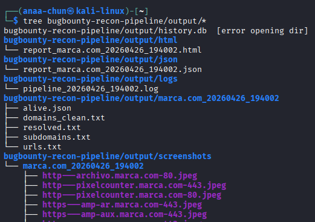 <br><br>


### Extracto del reporte JSON generado
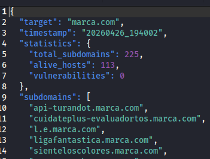 <br>
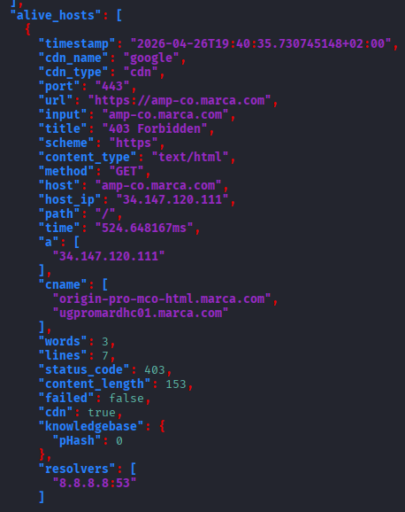 <br>
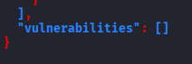 <br><br>


### Extracto del reporte HTML generado
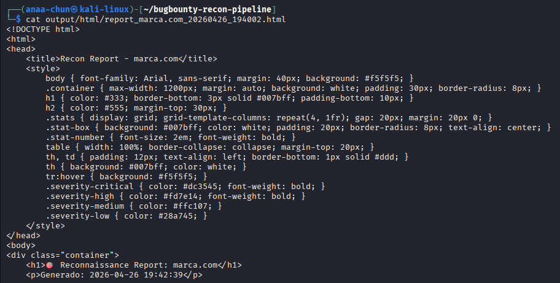 <br>
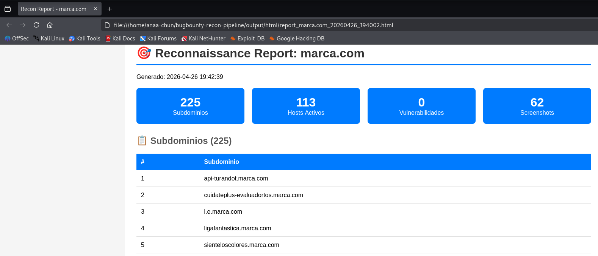 <br>
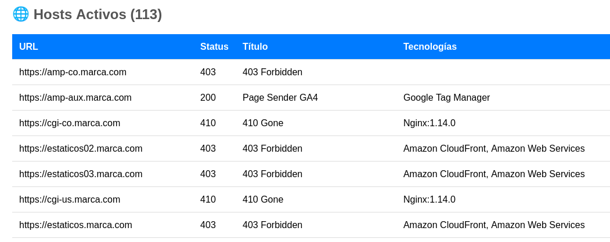 <br>
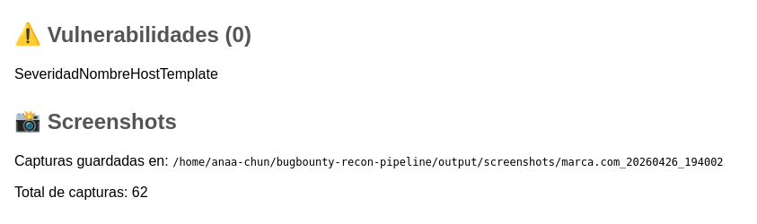 <br><br>

### Capturas de pantalla generadas (GoWitness)
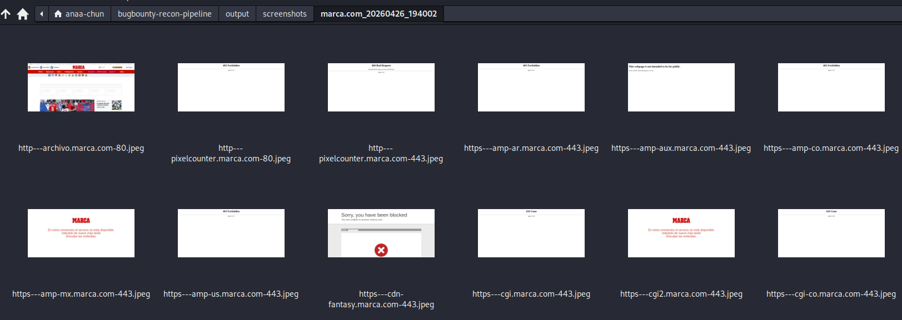 <br><br>


### Notificación de Telegram
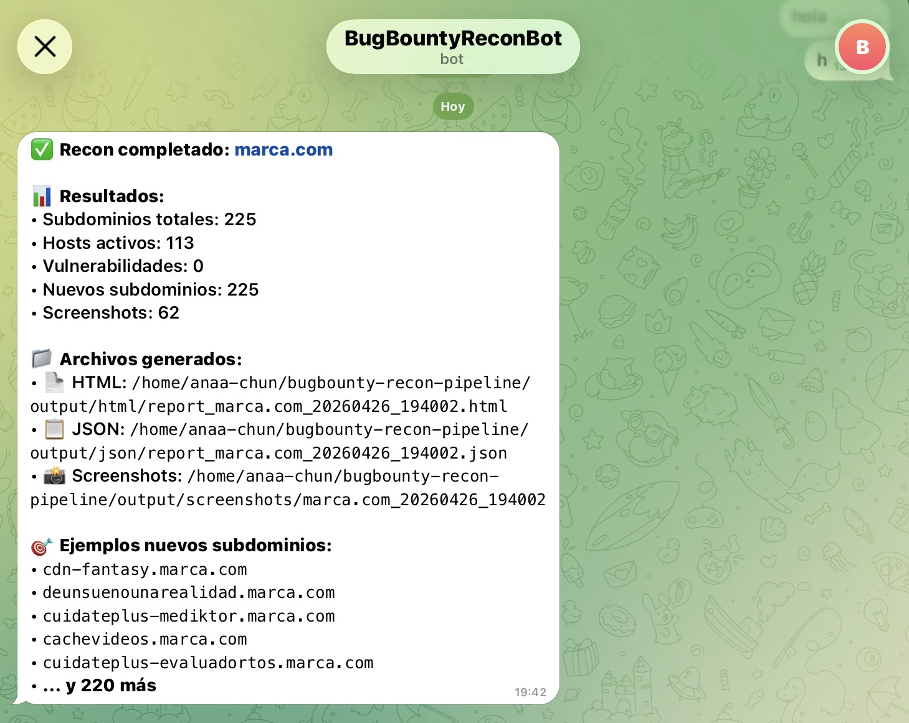


<br>

## 💡 Buenas prácticas y notas adicionales

### Seguridad y legalidad

- ✅ **Solo escanea dominios autorizados**: verifica siempre el scope del programa de Bug Bounty antes de ejecutar.
- ✅ **Respeta los rate limits**: muchos programas tienen restricciones sobre la velocidad y volumen de escaneo. Ajusta los threads en la configuración si es necesario.
- ❌ **Nunca uses esta herramienta en targets fuera de scope**: podría derivar en consecuencias legales.

### Rendimiento

- Para dominios grandes (+500 subdominios), ejecuta el pipeline con `nohup` o dentro de una sesión `tmux`/`screen` para evitar interrupciones.
- Ajusta el parámetro `threads` de HTTPx y GoWitness en `config.json` según los recursos de tu máquina y la tolerancia del target.
- En entornos con ancho de banda limitado, reduce la concurrencia de Nuclei (`concurrency`) para evitar falsos positivos por timeout.

### Gestión de resultados

- Los reportes HTML son autocontenidos y pueden abrirse directamente en el navegador.
- Utiliza el reporte JSON para integrar los resultados con otras herramientas de tu stack (Burp Suite, Jira, Notion, etc.).
- Revisa siempre manualmente los resultados de Nuclei antes de reportar vulnerabilidades: pueden existir falsos positivos.
- La base de datos `history.db` es útil para monitoreo continuo: detecta nuevos subdominios que aparecen con el tiempo.

### Configuración de Telegram

- Crea un bot con [@BotFather](https://t.me/BotFather) en Telegram para obtener el `bot_token`.
- Obtén tu `chat_id` enviando un mensaje a tu bot y consultando: `https://api.telegram.org/bot<TOKEN>/getUpdates`
- Mantén el `bot_token` fuera del repositorio (el `.gitignore` ya excluye `config/config.json`).

### Mantenimiento

- Actualiza los templates de Nuclei regularmente para detectar las últimas vulnerabilidades:

  ```bash
  nuclei -update-templates
  ```

- Actualiza las herramientas de Go periódicamente para obtener mejoras de rendimiento y correcciones:

  ```bash
  go install -v github.com/projectdiscovery/subfinder/v2/cmd/subfinder@latest
  go install -v github.com/projectdiscovery/dnsx/cmd/dnsx@latest
  go install -v github.com/projectdiscovery/httpx/cmd/httpx@latest
  go install -v github.com/projectdiscovery/nuclei/v3/cmd/nuclei@latest
  go install github.com/sensepost/gowitness@latest
  ```

<br>

## 📄 Licencia
 
Este proyecto está distribuido bajo la licencia MIT.
 
[](LICENSE)
 
---


<p align="center">
  El recon no es ruido, es inteligencia — hazlo bien, hazlo automático.<br>
  <sub>Autor: Ana Chun</sub>
</p>
